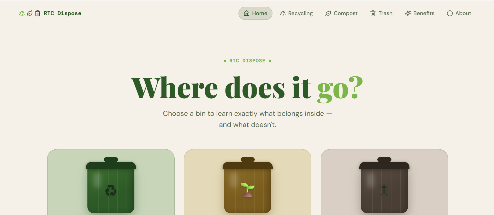

# RTC Dispose
A website built to teach people where to throw away their stuff in the best manner for the environment.

## Screenshots

  # Recycling Website
1. The Recycling page was made.  
2. The Trash page was made.  
3. The Compost page was made.  
4. The Benefits page was made.  
5. The Home page was made.  
6. The About Us page was made.  
  ## Running the code

  Run `npm i` to install the dependencies.

  Run `npm run dev` to start the development server.

## Important Notes
Made with Figma to design website

## Keshav Documentation

  1. Directed everyone into doing what they need to do
  2. Helped direct the prompt for Figma 
  3. Imported code from Figma
  4. Helped maintain and push code from and into GitHub
  5. Helped teammates when they ran into issues
  6. Helped update code in about me
  7. Fact-checked claims on the website

## Javion Documentation

  1. Created the Figma outline
  2. Projected the website MVP
  3. Assisted others in various tasks along the website
